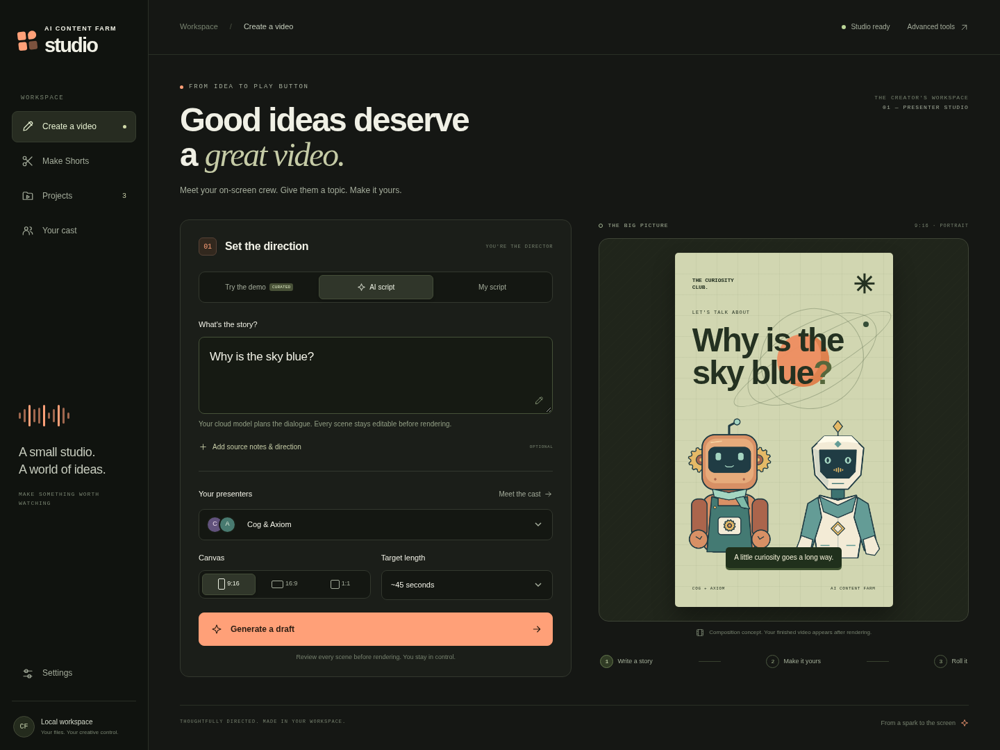
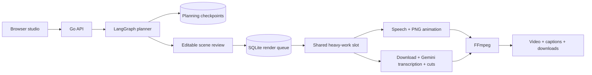

# AI Content Farm

**An editable video studio for ideas, PNG presenters, and long-form video repurposing.**

Turn a topic or your own script into a conversation between two animated presenters. Review every scene, render a narrated video, and export the MP4 and captions. Or bring a long video and turn it into a batch of vertical Shorts.

Built with **Go · LangGraph · Gemini · SQLite · Python · FFmpeg**, with a responsive browser studio, cloud speech and transcription, and a lightweight no-key demo.



[Watch a real generated example](docs/demo/binary-search.mp4) · [Read its captions](docs/demo/binary-search.srt) · [Mobile studio](docs/screenshots/studio-mobile.png)

## Try it

With Docker Engine, Compose v2.24+, and Buildx installed:

```bash
git clone https://github.com/DeadIndian/AI-Content-Farm.git
cd AI-Content-Farm
bash scripts/docker-start.sh
```

Open **http://localhost:8080**. In **Create a video**, choose **Try the demo**, a topic, and the original **Cog & Axiom** cast. Build a draft, edit the dialogue and scene cards, and render a preview. Choose **eSpeak** for a lightweight no-key demo, or configure Gemini for cloud narration. The installed eSpeak demo works offline.

For Shorts, open **Make Shorts**, upload a video or paste a YouTube video URL, and choose **30, 40, or 45 seconds** (or a custom length from 5–45 seconds). **Fixed length** splits the full source in order; **Natural cuts** prefers sentence endings. Choose **Reel** for gentle zooms, enhanced color, a vignette, balanced speech volume, and animated highlighted captions. Select **Make the cuts** to export every part, including the shorter ending. Clips and their ZIP download appear in **Projects**. Use **Edit batch** to change all cuts, or **Edit this Short** to change one clip's source start, length, layout, and style; each edit creates a new version while keeping previous exports.

Captioned Shorts use Gemini cloud transcription and require `GEMINI_API_KEY`. Turn captions off for editing without a model call. Downloaded sources are retained by default and transcripts are reused for re-edits. Local model loading is disabled by default. See the [Shorts runtime guide](docs/runtime-guide.md#long-video-to-shorts) for timing, disk usage, and API details.

## What works

| Workflow | What you get |
| --- | --- |
| Topic → presenter video | LangGraph plans structured dialogue and scene cards through Gemini or a configured compatible cloud API. Every line stays editable. |
| No-key demo | Three curated explainers: blue skies, binary search, and black holes. Real speech, animated PNGs, and MP4 output. |
| Your script → video | Manual mode preserves your wording and divides it into alternating presenter scenes. |
| Long video → Shorts | Full-source batches, adjustable lengths, fixed or sentence/pause cuts, cinematic Reel styling, animated highlighted captions, batch and individual re-edits, and ZIP exports. |
| Cast | Original Cog & Axiom, optional Nova & Atlas, imported PNG pairs with configurable roles and expressions, and personal Ryusui/Senku or Ryusui/Sai presets. |
| Review and recovery | Scene editing, browser draft persistence, visible planning traces, persistent jobs, cancellation, retries, and restart recovery. |
| Export | Portrait, landscape, or square presenter MP4s; posters and SRT captions. Shorts use 1080×1920 H.264/AAC. |

Demo mode uses curated scripts. AI mode requires a configured model and does not independently browse or fact-check the web. Presenter visuals are designed scene cards. Gemini provides cloud narration; lightweight eSpeak sounds robotic. Cloud caption timings are estimated and should be reviewed. Shorts cover the source sequentially with fixed layouts; there is no virality prediction or active-speaker tracking. Nothing is automatically published.

## Native development

Requires Linux, **Go 1.25+**, **Python 3.11+**, FFmpeg/ffprobe, eSpeak NG, and DejaVu fonts. YouTube extraction also needs Deno 2.3+ or Node 22+. Process-group cancellation targets Linux; use Docker on other platforms.

```bash
# Debian / Ubuntu system dependencies
sudo apt-get install ffmpeg espeak-ng fonts-dejavu-core python3-venv

python3 -m venv .venv
.venv/bin/pip install -r requirements-studio.lock -r requirements-shorts.txt
cp .env.example .env
bash scripts/run-local.sh
```

The launcher builds the Go server, selects the virtual environment, and loads `.env`. `npm run start` is an equivalent convenience command. Node is not required to serve the frontend. The original narrated-video studio and library tools remain at **/legacy.html**.

## Cloud models and voices

For open-ended topic generation, speech, and captioned Shorts, set these in the ignored `.env` file and restart:

```dotenv
GEMINI_API_KEY=your-key
GEMINI_MODEL=gemini-2.5-flash
GEMINI_TRANSCRIPTION_MODEL=gemini-2.5-flash
GEMINI_TTS_MODEL=gemini-2.5-flash-preview-tts
GEMINI_TTS_VOICE_A=Puck
GEMINI_TTS_VOICE_B=Kore
STUDIO_TTS_PROVIDER=gemini
SHORTS_TRANSCRIBER=gemini
ALLOW_LOCAL_MODELS=false
```

Gemini requests use your account's quota and billing. Keys stay on the server. Provider failures appear in the job; failed cloud work never silently starts a local model. Optional source notes guide the planner, and reference links remain available for review. An explicitly configured cloud chat-completions API can use `LLM_BASE_URL`, `LLM_API_KEY`, and `LLM_MODEL`; OpenRouter settings are also supported.

Each render can select **Gemini cloud** or **eSpeak**. When `STUDIO_TTS_PROVIDER` is unset, Gemini is preferred if its key is configured; otherwise eSpeak is selected. eSpeak is a lightweight speech synthesizer and does not load a neural model. Gemini uses estimated caption timing; eSpeak supplies word events where available.

Piper and CPU/NPU Whisper are retained as optional integrations for capable machines. They require an explicit `ALLOW_LOCAL_MODELS=true`. To enable the Piper container after opting in:

```bash
bash scripts/docker-start.sh --studio
```

```dotenv
ALLOW_LOCAL_MODELS=true
STUDIO_TTS_PROVIDER=piper
STUDIO_VOICE_A=en_US-lessac-medium
STUDIO_VOICE_B=en_US-ryan-medium
```

Docker configures the Piper service address. Native users can set `TTS_BASE_URL=http://localhost:5002`. Piper needs voice model downloads and is excluded from the default cloud workflow.

## Cast and rendering budget

**Cog** is a curious copper tinkerer; **Axiom** is a calm geometric scientist. Their original idle, speaking, and blink PNGs are included. Nova & Atlas remain available as another original pair.

The Cast view accepts two presenters, names, roles, and idle PNGs, with optional speaking and blink expressions. Uploaded pairs are stored in `data/cast/<id>/cast.json`; the same registry supplies names and roles to planning and artwork to rendering. A still-only import keeps its original expression and uses audio-driven motion. The upload API validates and decodes images, with a 4 MB per-image and 16 MB total limit. See [cast setup](assets/presenters/README.md) for the manifest and personal imports. Personal fictional artwork and voice references are excluded from the public repository.

`STUDIO_RESOURCE_MODE=gentle` is the default: portrait previews are **360×640 at 12 fps**, landscape **640×360**, and square **360×360**. Rendering uses one FFmpeg encoder thread and reduced process priority. Full exports remain available at 1080×1920, 1920×1080, or 1080×1080, at 24 fps; use them after reviewing a preview.

Presenter rendering pauses at **75°C** and resumes at **70°C** when a CPU sensor is available. Checks run before work, between scenes, and during longer frame loops. If a sensor is unavailable, the job reports it and keeps the resource limits. Threshold checks reduce load; they are not a hardware temperature guarantee.

## Architecture



LangGraph owns structured planning with recorded node outcomes; Go owns long-running job lifecycles. Rendering is deterministic code, and model output is treated as data. The heavy-work gate serializes presenter, legacy, and Shorts processing.

Read the [architecture and tradeoffs](docs/architecture.md), [research and project lineage](docs/research.md), and [runtime/resource guide](docs/runtime-guide.md).

## Verification

```bash
go test -p=1 -race ./...
go vet -p=1 ./...
.venv/bin/python -m unittest discover -s scripts -p 'test_*.py'

# Optional media checks; run sequentially only when the machine is cool
STUDIO_RUN_MEDIA_TESTS=1 .venv/bin/python scripts/test_studio_render.py

# Real planner → render → HTTP-download integration, no API key
STUDIO_INTEGRATION_ROOT="$PWD" go test ./internal/httpserver -run TestStudioRealPipeline -v

# Browser journeys; start the app first
npm ci
npx playwright install chromium
PLAYWRIGHT_BASE_URL=http://127.0.0.1:8080 npm run test:browser

# Include the real presenter render and two-Shorts ZIP browser journeys
STUDIO_RUN_MEDIA_TESTS=1 PLAYWRIGHT_BASE_URL=http://127.0.0.1:8080 npm run test:browser
```

Tests cover malformed model responses, scene validation, source-note handling, checkpoints, recovery, cancellation, retries, safe output access, audio/video streams, animated frames, captions, responsive navigation, and actual browser workflows. See [verification results](docs/verification.md) for tested conditions and remaining limits.

A [GitHub Actions template](docs/ci/README.md) runs media checks on a remote runner. Activation requires permission to edit Actions workflows; it is not active in this branch.

## Project story

This consolidates useful ideas from my earlier faceless-video projects, typed-scene experiments, and Hermes PNG-presenter pipeline into AI-Content-Farm. It preserves the existing Go/SQLite Shorts engine and adds a complete create–review–render experience.

An accurate resume description:

> Built a video studio using Go, LangGraph, Gemini, SQLite, and FFmpeg, with editable AI scene plans, configurable PNG presenters, cloud speech and transcription, durable render jobs, and long-video-to-Shorts exports; validated recovery, cancellation, media output, and browser journeys.

GPL-3.0. Original cast artwork is included under the repository license. Dependencies and optional models retain their respective licenses.
